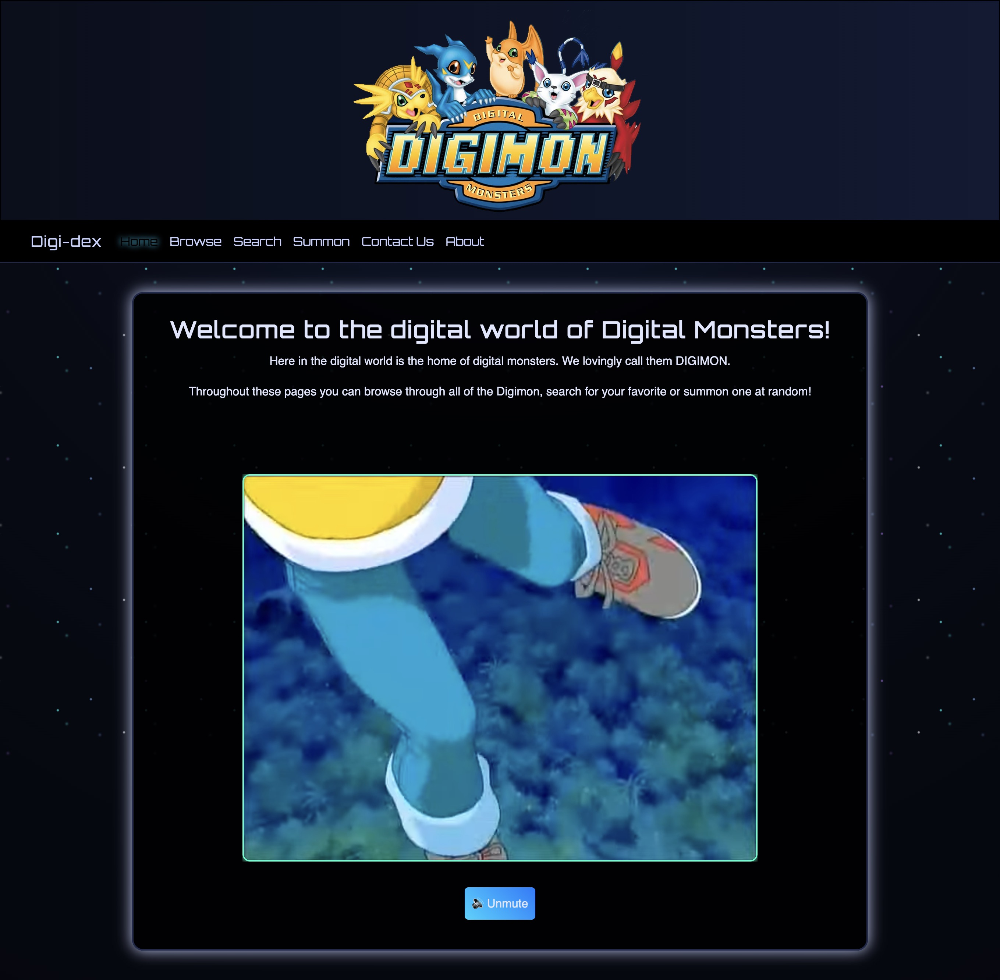
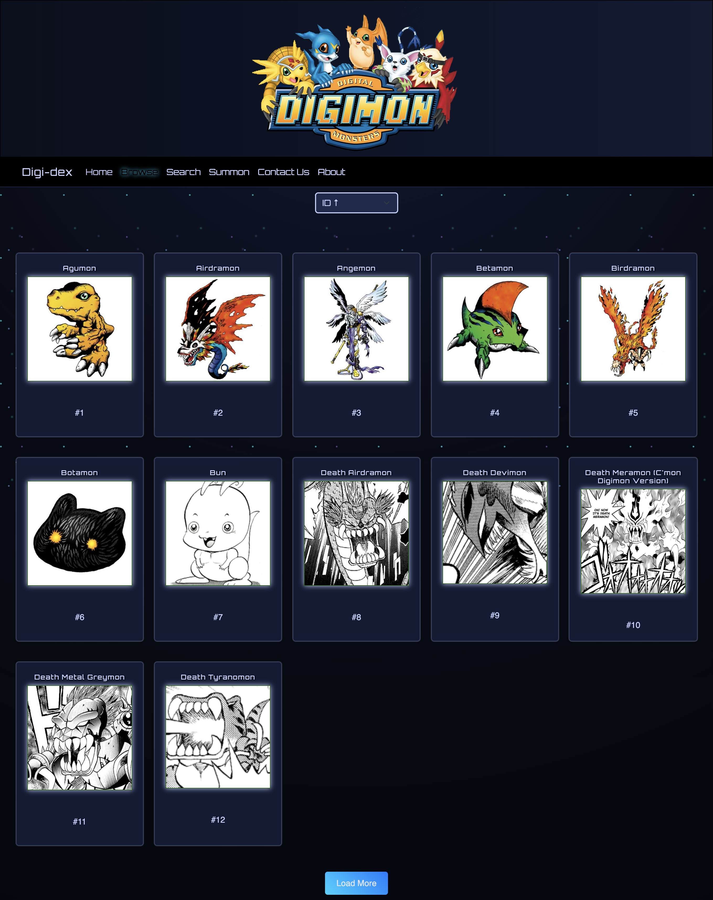
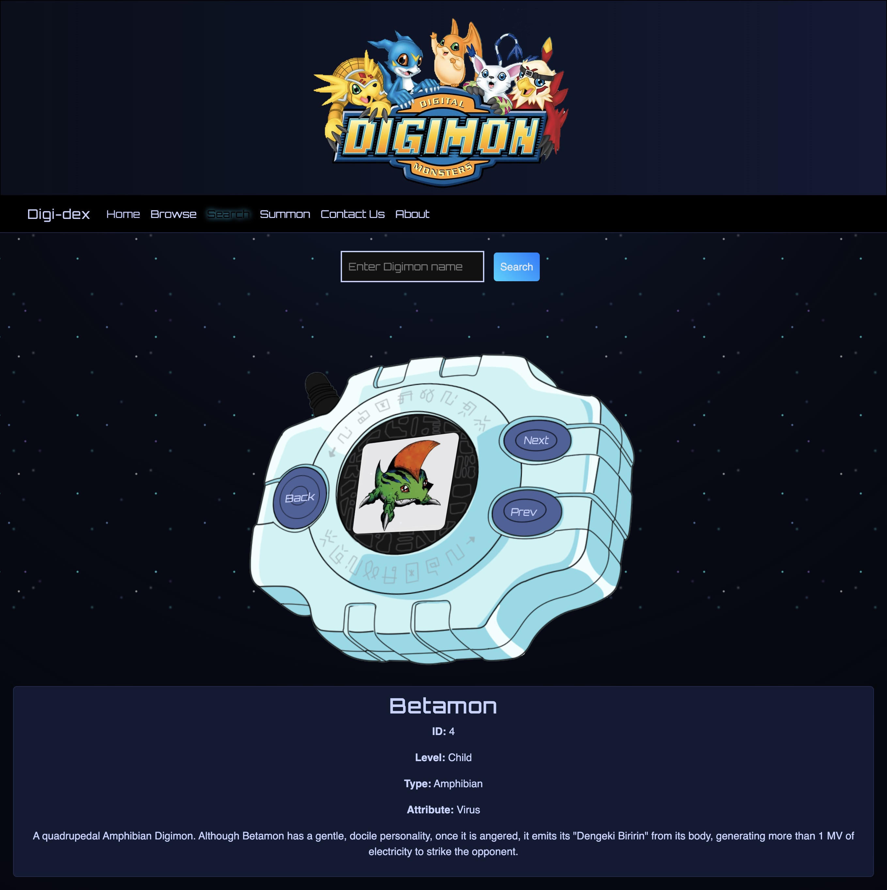
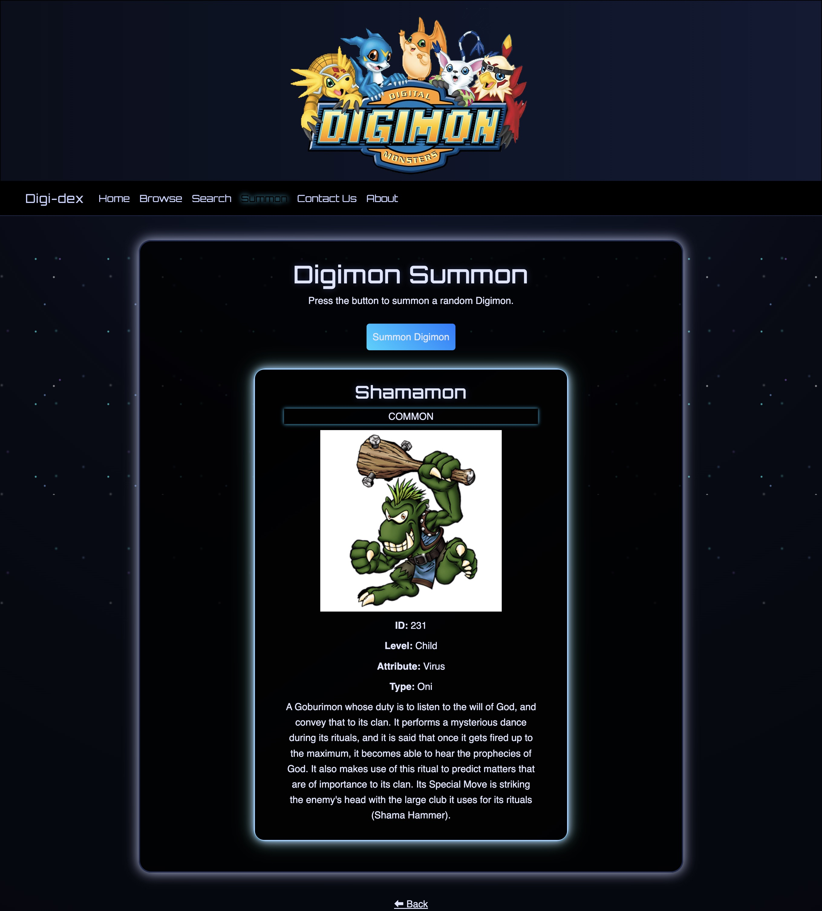
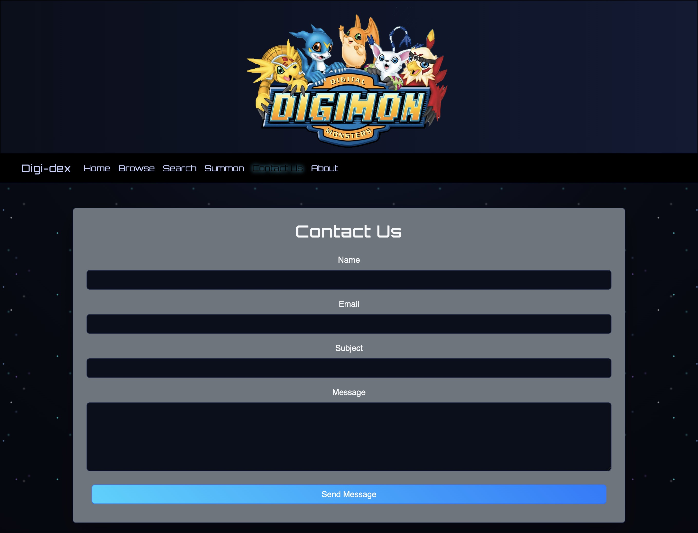
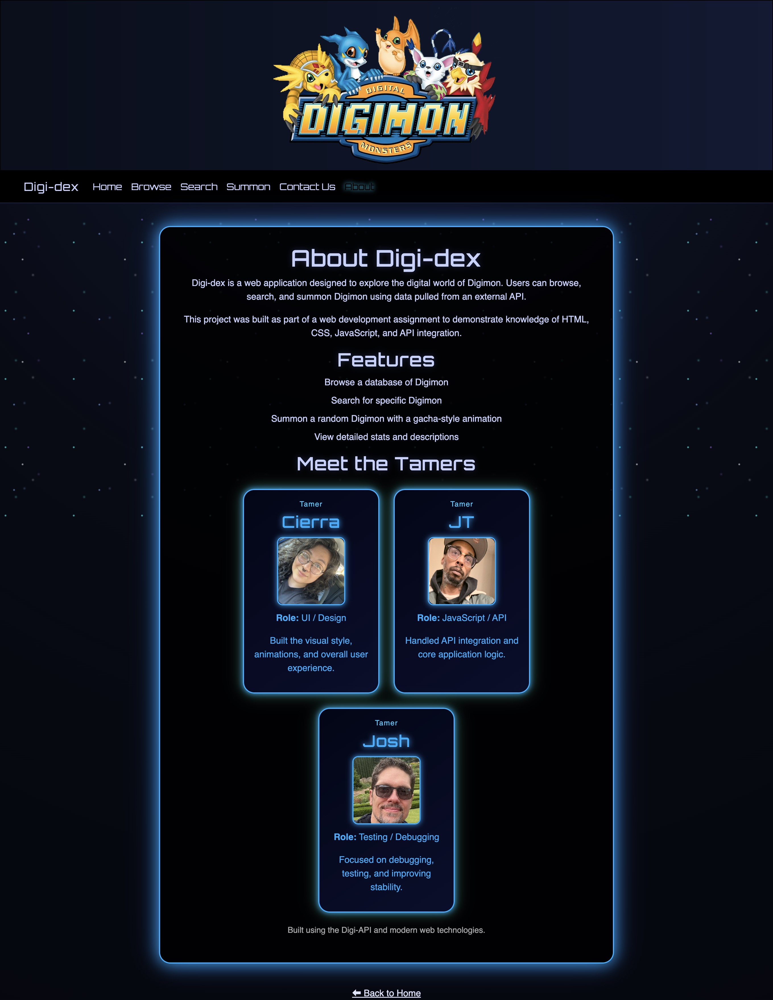

# Digimon-digidex

---

## Collaborators

**Josh Cleveland**
**Cierra Franco-Hover**
**JT Roudebush**

---

## Description

Digi-dex is a web application designed to explore the digital world of Digimon. Users can browse, search, and summon Digimon using data pulled from an external API.

This project was built as part of a web development assignment to demonstrate knowledge of HTML, CSS, JavaScript, and API integration.

### Page Features

**Home** - A landing page welcoming visitors to the site and displaying a video of the Digimon cartoon.
**Browse** - Displays a grid of Digimon from API database. Users can sort Digimon by ID or alphabetically in ascending or descending order. Users can load more digimon via the load button to see all 1488 Digimon. If a user clicks on a digimon card they will be redirected to the search page which provides more detail.
**Search** - Allows users to search for Digimon by name. Displays Digimon on the "Digivice" and displays more detailed information about the Digimon on a card below. The Digivice's buttons are wired with JavaScript to allow for _Back_, _Next_, and _Prev_ functionality.
**Summon** - Allows the user to summon a random Digimon with a gacha-style animation. When user clicks the button a random digimon card flips onto the screen with attributes and detailed description.
**Contact Us** - A form page for users to create a short message for the admins.
**About** - A page displaying information about the project and the collaborators.

---

## 🌐 Live Deployment Link

## [Live Site](https://jcleve00.github.io/Digimon-digidex/)

## 📸 Screenshots

### Home

### Browse

### Search

### Summon

### Contact Us

### About

